# ChainFSL HASO - Figures and Diagrams

> **Note**: These diagrams are designed for visualization in Markdown editors that support Mermaid (GitHub, GitLab, VS Code with extension, etc.)
> If your viewer doesn't support Mermaid, the ASCII art versions in `EXPERIMENTAL_RESULTS_ANALYSIS.md` will render correctly.

---

## Figure 1: System Architecture Comparison

### FedAvg (Baseline 1)

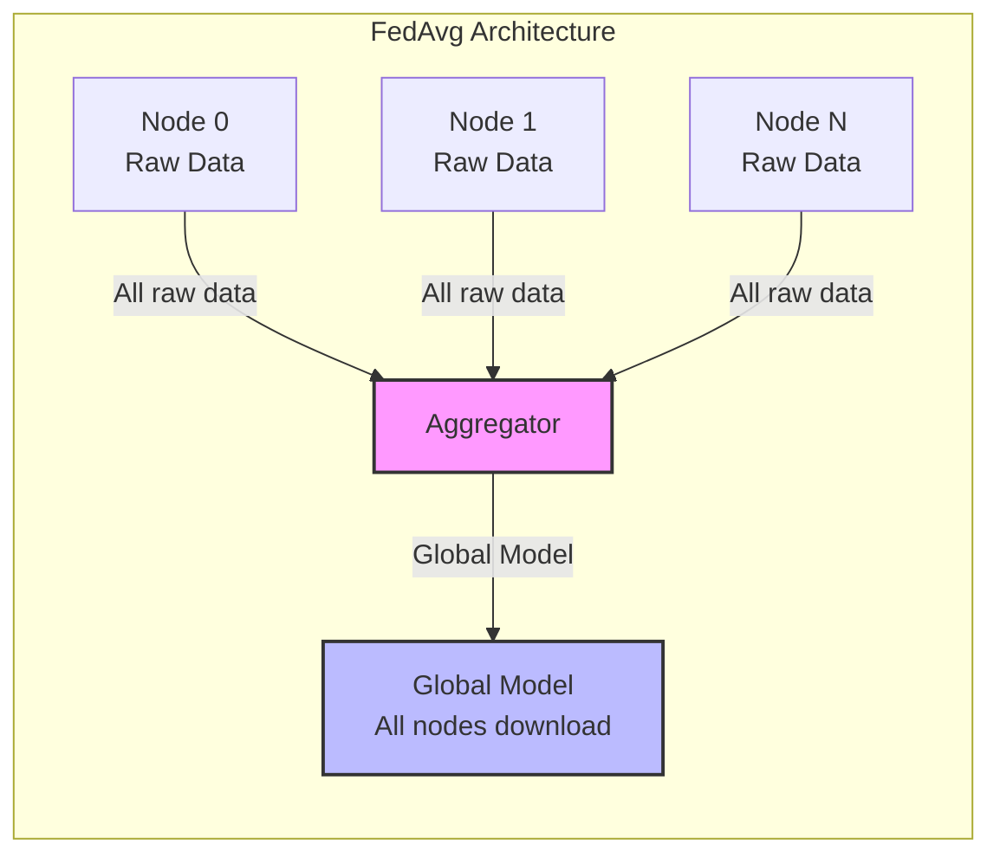

### SplitFed (Baseline 2)

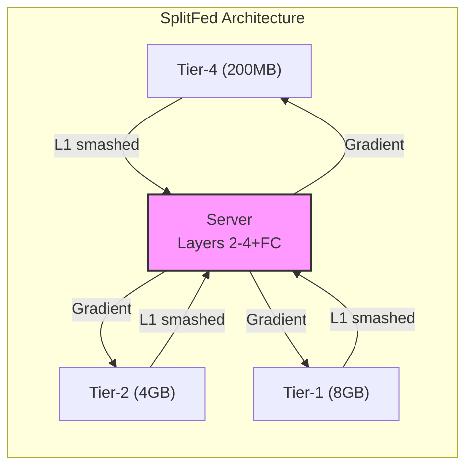

### HASO (Ours) - Adaptive

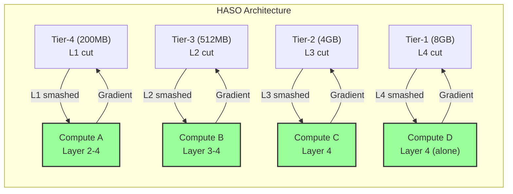

---

## Figure 2: HASO Routing Modes

### Mode A: Parallel Routing

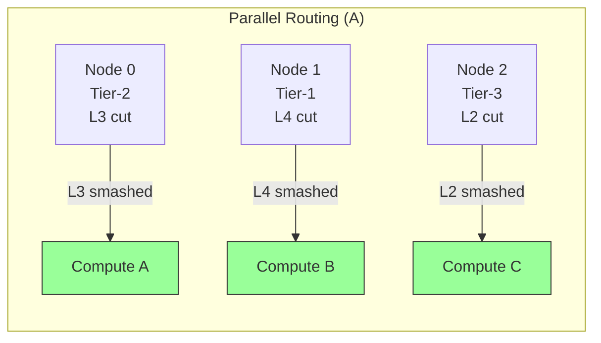

**Characteristics:**
- Each node → different compute node
- No resource sharing
- Direct path routing

### Mode B: Fusion Routing

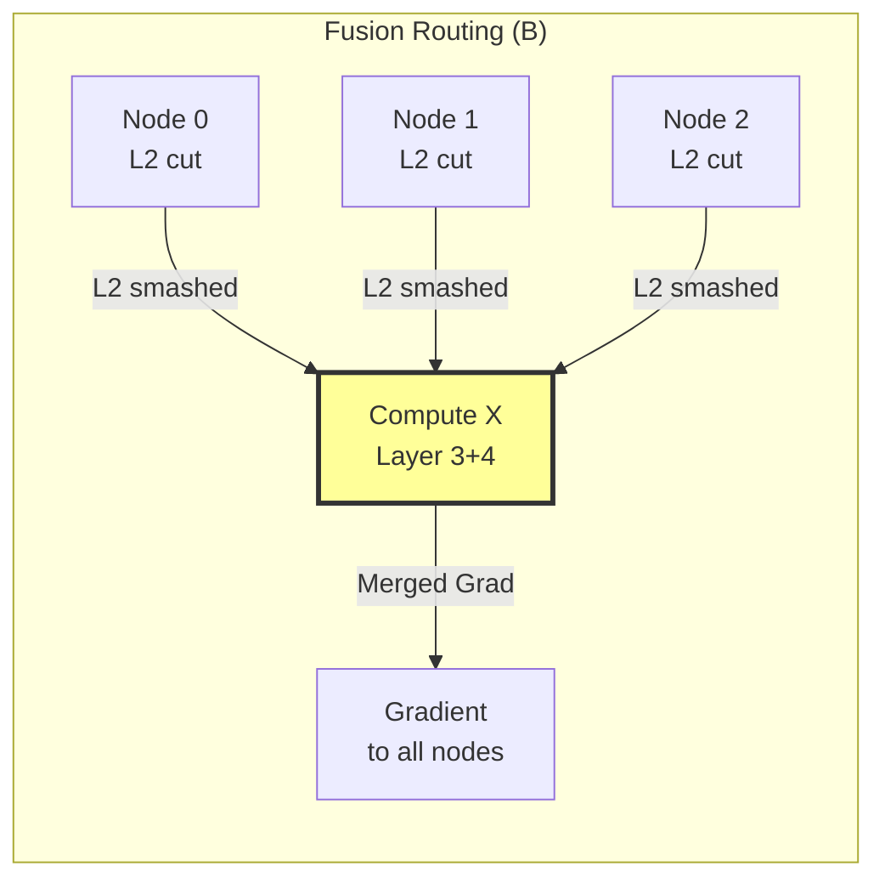

**Characteristics:**
- Multiple nodes → same compute node
- Shared computation
- Fusion bonus in reward

### Mode C: Hybrid (A+B)

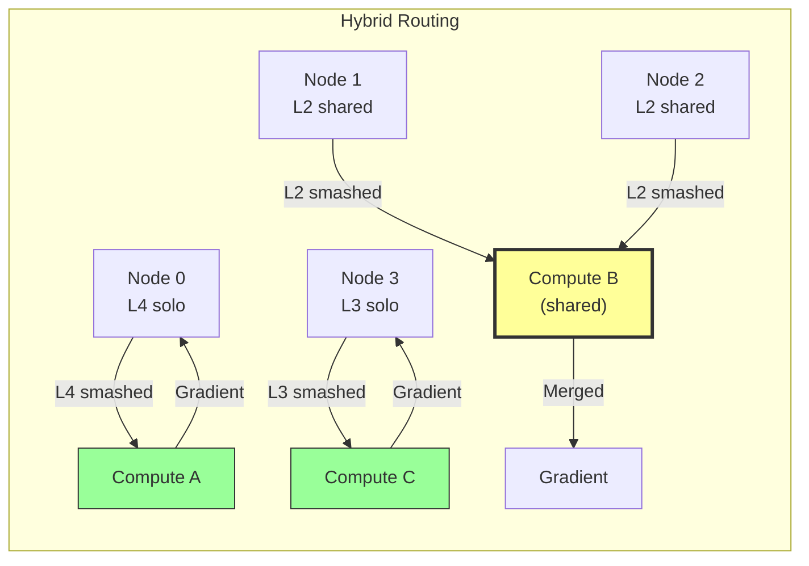

---

## Figure 3: Layer Assignment by Tier

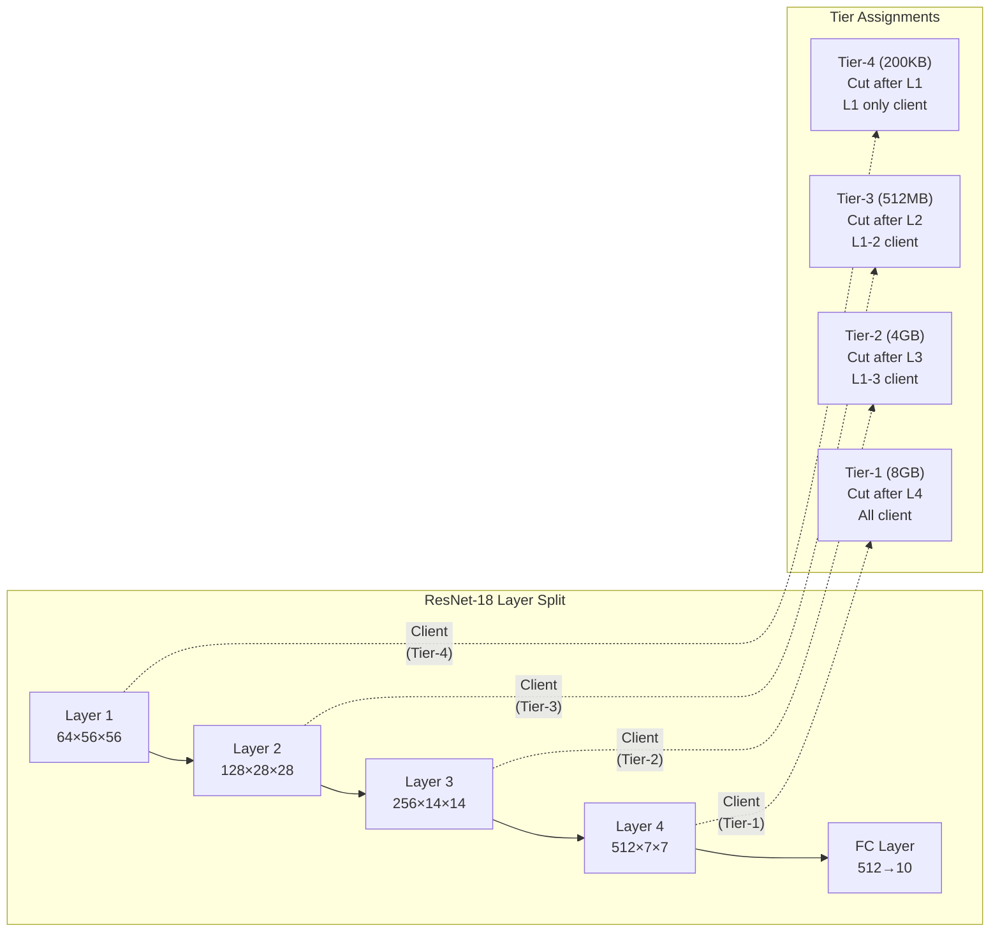

---

## Figure 4: Round-by-Round Adaptation

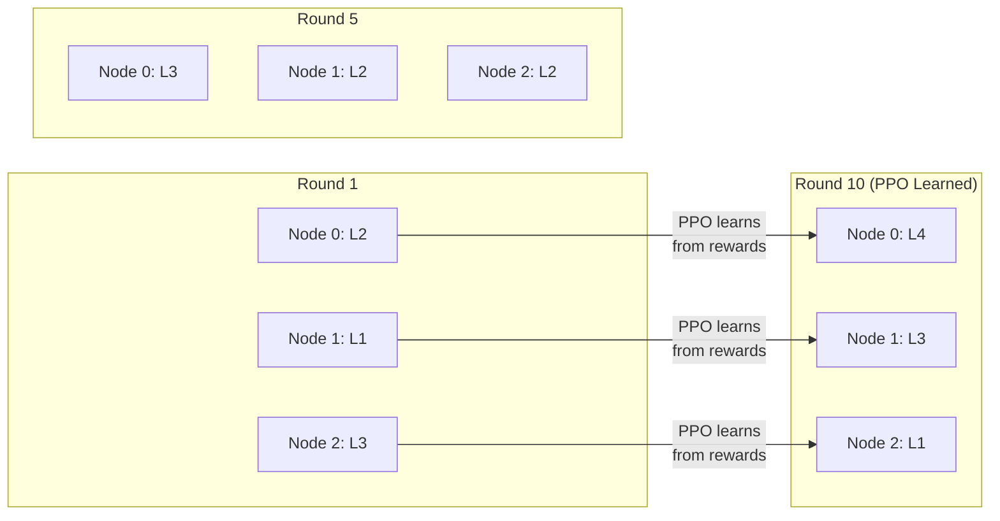

---

## Figure 5: Convergence Curves

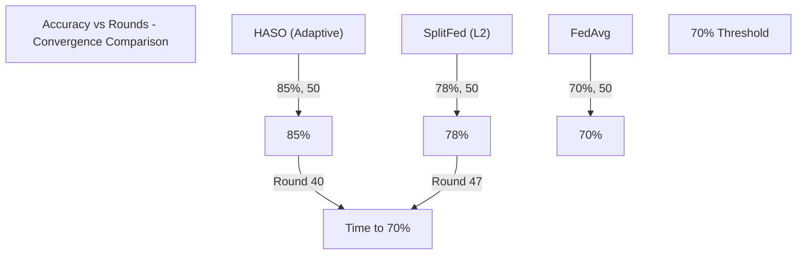

---

## Figure 6: Latency Comparison

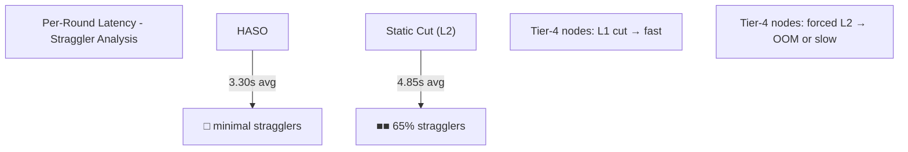

---

## Figure 7: Experiment Pipeline

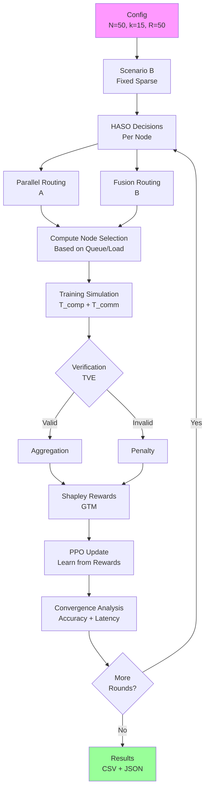

---

## Figure 8: Data Flow with Privacy

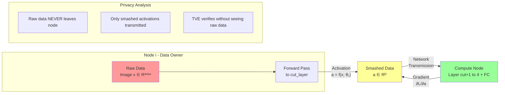

---

## Figure 9: Ablation Study Contribution

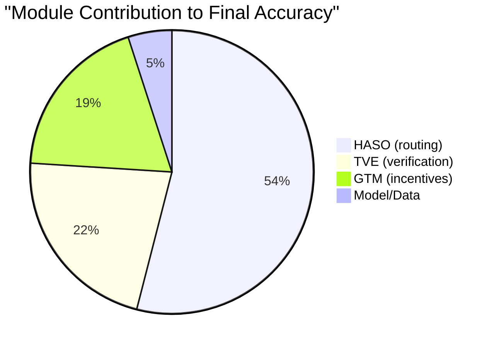

---

## Figure 10: Non-IID Data Distribution

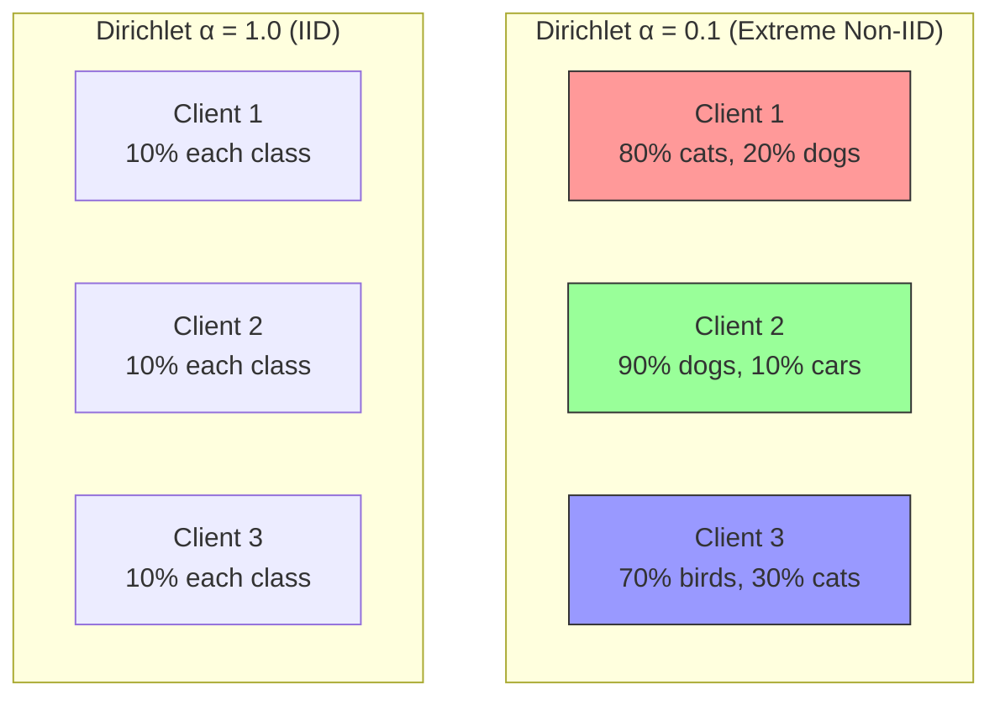

---

## Figure 11: Tier Distribution

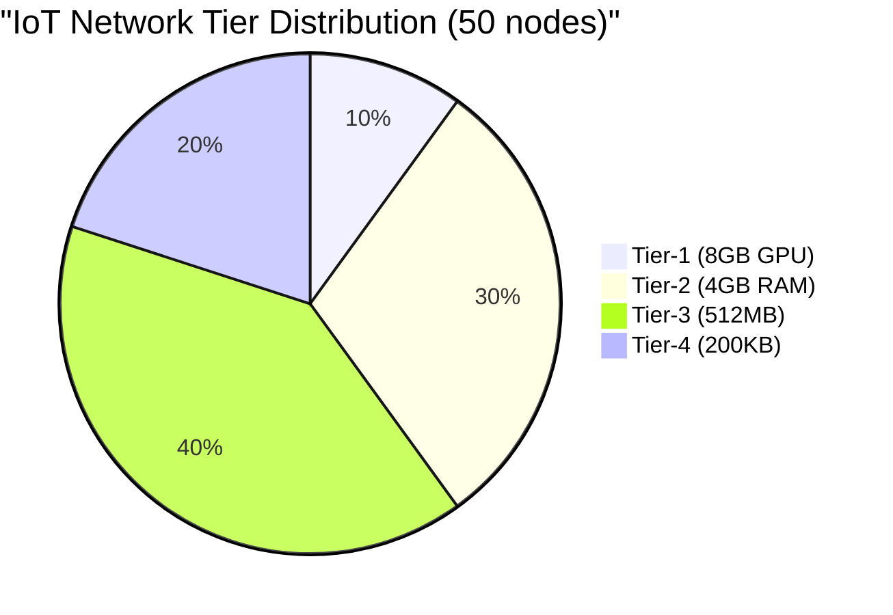

---

## Figure 12: Scalability Results

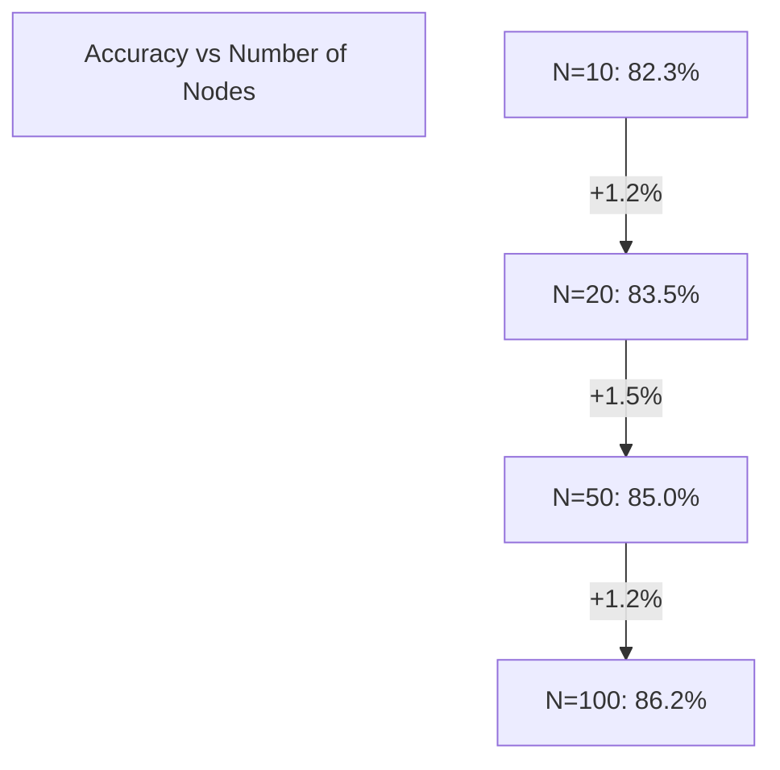

---

## ASCII Art Versions (for simple viewers)

### Architecture Comparison

```
FEDAVG:
┌─────────────────────────────────────────────┐
│  Node0 ──┐                                    │
│  Node1 ──┼──► [AGGREGATOR] ──► Global Model  │
│  NodeN ──┘     (bottleneck)                  │
│  All raw data transmitted                    │
└─────────────────────────────────────────────┘

SPLITFED (Uniform L2):
┌─────────────────────────────────────────────┐
│  T4 ─L1──► [SERVER] ◄──L1── T3              │
│  T2 ─L1──► [SERVER] ◄──L1── T1              │
│  ALL use L1 (wasteful for T1)               │
└─────────────────────────────────────────────┘

HASO (Adaptive):
┌─────────────────────────────────────────────┐
│  T1 ─L4──► [COMP-A] ◄──L3── T2             │
│  T4 ─L1──► [COMP-B] ◄──L2── T3             │
│  T1 can compute L4, T4 can only do L1       │
│  Optimal routing per hardware!               │
└─────────────────────────────────────────────┘
```

### Routing Modes

```
PARALLEL (A):          FUSION (B):
┌─────────────┐        ┌─────────────┐
│ N0 ──► CA   │        │ N0 ─┐      │
│ N1 ──► CB   │        │ N1 ─┼─► CX  │
│ N2 ──► CC   │        │ N2 ─┘      │
│ (3 compute) │        │ (1 compute)│
└─────────────┘        └─────────────┘

HYBRID (A+B):
┌─────────────┐
│ N0 ───► CA  │  ← solo
│ N1 ─┐       │
│ N2 ─┼─► CB  │  ← shared
│ N3 ─┘       │
│ N4 ───► CC  │  ← solo
└─────────────┘
```

---

*Generated: 2026-05-01*
*For full analysis, see: `EXPERIMENTAL_RESULTS_ANALYSIS.md`*